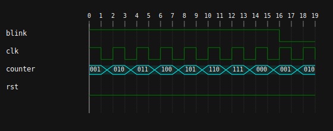

# go-vcd2svg

**go-vcd2svg** is a command-line utility written in pure Go for converting VCD (Value Change Dump) files into SVG diagrams.

This utility currently only supports very simple use cases, and is unlikely to scale well for larger VCD files. If you have the need for a more complete feature set consider using a utility such as [Sootty](https://github.com/Ben1152000/sootty). The feature set of this utility may be expanded in the future to support additional features.

## Installation
Install `go-vcd2svg` by running the following command to install the utility to `$GOPATH/bin`:

```bash
go install github.com/titan098/go-vcd2svg@latest
```

## Usage
To convert a VCD file to an SVG diagram, use the following command, where `-i` and `-o` specify the input and output respectively:

```bash
./go-vcd2svg convert -i input.vcd -o output.svg
```

### Library Usage

You can use the functionality in the `waveform` package directly in your own Go application.

First, add the package to your project:

```bash
go get -u github.com/titan098/go-vcd2svg@latest
```

Example of using the `waveform` package to parse a VCD file and print out the parsed signals and rendered:

```go
package main

import (
    "fmt"
    "log"
    "os"

    "github.com/titan098/go-vcd2svg/waveform"
)

func main() {
    file, _ := os.Open("input.vcd")
    defer file.Close()

    wv, _ := waveform.ParseVCD(file)

    for name, signal := range wv.Signals {
        fmt.Printf("Signal: %s, Values: %v\n", name, signal.Values)
    }

    svg := waveform.SvgFromFile("input.vcd")
    os.WriteFile("output.svg", svg, 0644)
}
```

### Example



## Alternatives

- [Sootty](https://github.com/Ben1152000/sootty) - A fully featured and mature alternative.

## References

- [go-vcd-parser](https://github.com/filmil/go-vcd-parser) - used for parsing the VCD file.
- [svgo](github.com/ajstarks/svgo") - uses for creating the SVG output.